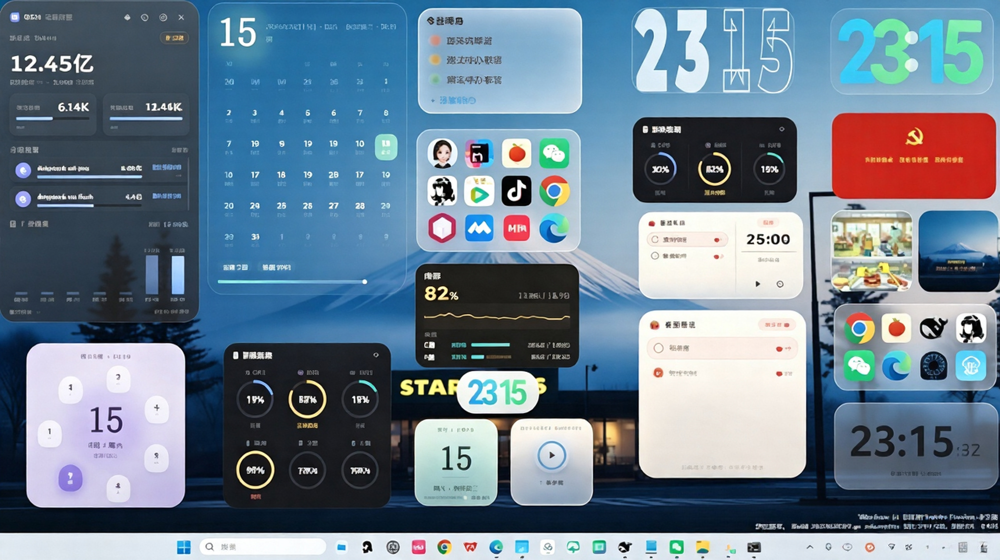
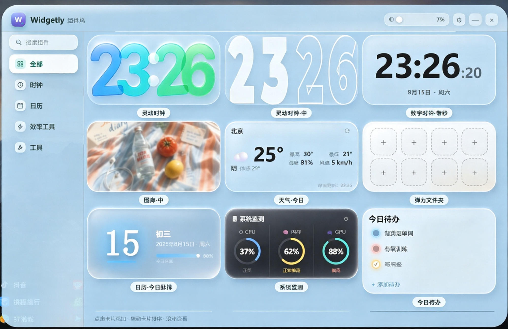

# ✨ Widgetly 组件坞 —— 让 Windows 桌面变成你的专属控制台

[](./LICENSE)
[](#)
[](https://github.com/3226194802/widgetly-releases/releases)

**一个管理器，管住你桌面上所有小组件。** 极简 iOS 风格、透明毛玻璃质感、本地运行零联网——把 Windows 桌面变成一块干净、好看、高效的信息面板。

> 🇬🇧 [English README](#english)

<p align="center">
  
</p>

---

## 🎯 它是什么

Widgetly（组件坞）是一个 Windows 桌面小组件中心：一个轻量的管理器窗口，加一批可以自由拖放、置顶、调透明度的桌面小组件。所有数据都在本地处理，不联网、无账号、无服务器，你的隐私完全掌握在自己手里。

<p align="center">
  
</p>

---

## ⭐ 核心特色

| 特色 | 说明 |
|---|---|
| 🖥️ **DeepSeek Harness 一键启动** | 内置 DSH 启动器组件，配置路径后一键拉起，不用再翻文件夹 |
| 📊 **Agent 平台用量监控** | 本地读取 Hermes / DeepSeek Harness / Claude Code / Codex 等 Agent 的 token 用量、成本、会话排行，随时掌握 AI 消耗 |
| 🕐 **灵动时钟**（标准/中/小） | 渐变数字、12/24 小时制、4 个数字独立配色 |
| 🌤️ **天气** | 实时天气 + 体感 + 湿度风速，自动定位城市 |
| 📅 **日历**系列（8 种） | 今日脉搏 / 胶囊日期 / 青柠 / 月相月历 / 周环 / 墨滴月历 / 全景，含农历 |
| 🗂️ **弹力文件夹** | 应用/文件快捷收纳，8 种排列布局 |
| 🍅 **番茄时钟 + 今日待办** | 专注计时（重启续跑）、每日待办清单 |
| 🖼️ **图库** | 本地图片无缝交叉淡化轮播 |
| 📈 **系统/内存监控** | CPU/GPU/内存/磁盘实时环形进度 + 内存心电图 |
| 🧩 **自由定制** | 每个组件都支持右键菜单、锁定、置顶、透明度，持久化到本地配置 |

---

## 📦 下载安装

点击下面链接下载最新版安装包：

👉 **[下载最新版本](https://github.com/3226194802/widgetly-releases/releases)**

- `Widgetly-Setup-*.exe` —— 安装版（推荐，支持软件内自动更新）
- `Widgetly-Portable-*.exe` —— 便携版（免安装，双击即用）

> 软件内置**在线更新**：打开「设置 → 检查更新」即可一键升级到最新版，无需手动下载。

---

## 🚀 快速开始

1. 下载并安装（或直接运行便携版）
2. 右下角托盘会出现 Widgetly 图标，点击打开**组件坞**
3. 在组件坞里点任意卡片，即可把它添加到桌面
4. 右键组件 → 拖动位置、锁定、置顶、调透明度、退出

---

## 🛠️ 系统要求

- Windows 10 / 11（x64）
- 无需安装 Python（仅 AI 用量监控的 Hermes 平台需要）

---

## 📖 目录结构

```
Widgetly/
├── main.js              # 主进程（窗口管理/托盘/拖动/配置）
├── manager/             # 组件坞（管理器）界面
├── widgets/             # 各组件（clock/dock/gallery/todo/calendar/...）
│   └── monitor/         # AI 用量监控（多 Agent 平台）
├── assets/              # 应用图标
└── docs/                # 截图等文档资源
```

---

## 🧑‍💻 开发者

```bash
npm install
npm start          # 开发运行
npm run build      # 打包安装版 + 便携版
npm run build:msix # 打包微软商店 MSIX
```

技术栈：**Electron 40** · 原生 Node（零前端框架）· koffi（Win32 互操作）· backdrop-filter 实时毛玻璃

---

## 📄 许可

本项目采用 [MIT License](./LICENSE) 开源。可自由使用、修改、商用、再分发，但需保留版权声明。

---

<a id="english"></a>

# ✨ Widgetly — Turn Your Windows Desktop into a Personal Command Center

[](./LICENSE)
[](#)
[](https://github.com/3226194802/widgetly-releases/releases)

**One manager for all your desktop widgets.** Minimal iOS-style design, frosted-glass transparency, fully offline — a clean, beautiful and efficient information panel right on your Windows desktop.

<p align="center">
  
</p>

## 🎯 What is it?

Widgetly is a **desktop widget center for Windows**: a lightweight manager window plus a collection of draggable, pinnable, opacity-adjustable desktop widgets. Everything runs 100% locally — no network, no account, no server. Your privacy stays in your hands.

<p align="center">
  
</p>

## ⭐ Key Features

| Feature | Description |
|---|---|
| 🖥️ **DeepSeek Harness Launcher** | One-click launcher widget for DeepSeek Harness — no more digging through folders |
| 📊 **Agent Usage Monitor** | Track token usage, cost and session rankings of Hermes / DeepSeek Harness / Claude Code / Codex locally |
| 🕐 **Gradient Clocks** (S/M/L) | Gradient digits, 12/24-hour, per-digit colors |
| 🌤️ **Weather** | Live weather + feels-like + humidity & wind |
| 📅 **Calendar family** (8 variants) | Monthly / weekly ring / pill date / panoramic views, lunar calendar included |
| 🗂️ **Spring Folder** | App/file shortcut dock with 8 layouts |
| 🍅 **Pomodoro + Todo** | Focus timer (survives restart) + daily todo list |
| 🖼️ **Gallery** | Local photo slideshow with cross-fade |
| 📈 **System / Memory Monitor** | CPU/GPU/RAM/disk ring gauges + live RAM ECG |
| 🧩 **Fully customizable** | Right-click menu on every widget: lock, pin, opacity, quit — all persisted locally |

## 📦 Download

👉 **[Download the latest release](https://github.com/3226194802/widgetly-releases/releases)**

- `Widgetly-Setup-*.exe` — installer (recommended, supports in-app auto-update)
- `Widgetly-Portable-*.exe` — portable (no installation needed)

> Built-in **auto-updater**: open **Settings → Check for Updates** to upgrade in one click.

## 🚀 Quick Start

1. Download and install (or run the portable version)
2. Click the Widgetly tray icon (bottom-right) to open the manager
3. Click any card in the manager to add it to your desktop
4. Right-click a widget to drag, lock, pin, adjust opacity, or quit

## 🛠️ Requirements

- Windows 10 / 11 (x64)
- Python only needed for the Hermes platform of the AI usage monitor

## 🧑‍💻 For Developers

```bash
npm install
npm start          # run in development
npm run build      # build installer + portable
npm run build:msix # build Microsoft Store MSIX package
```

Tech stack: **Electron 40** · vanilla Node.js (no frontend framework) · koffi (Win32 interop) · backdrop-filter live frosted glass

## 📄 License

Open-sourced under the [MIT License](./LICENSE). Free to use, modify, redistribute and use commercially, as long as the copyright notice is retained.
